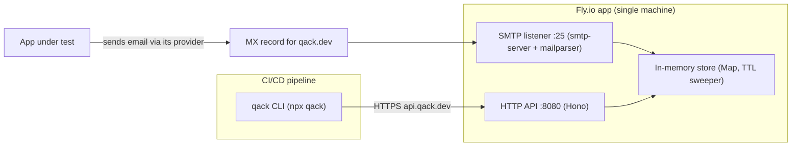

# Qack.dev — Temporary Email Testing Service (CLI + Server + Turborepo)

## A: Plan Overview

Qack.dev is a temporary email service for CI/CD pipelines. A CI job creates a throwaway inbox like `f3k9x2@qack.dev`, points the app-under-test at it, and then uses the CLI to fetch or wait for incoming messages (OTP emails, verification links, etc.). The CI script does its own parsing of message content.

This is a greenfield project. The repository is currently empty. We are building a Turborepo (pnpm workspaces) containing:

1. **`apps/cli`** — A TypeScript/Node CLI published to npm as `qack`, runnable via `npx qack ...` on Mac/Linux. Commands: create an inbox, list messages, get a full message, wait (block) for a new message, and delete an inbox.
2. **`apps/server`** — A single Node process that runs both an inbound SMTP server (accepts mail for `*@qack.dev` on port 25) and an HTTP API (consumed by the CLI). Messages are stored **in-memory only** with TTL-based expiry. Deployed to **Fly.io** with a dedicated IPv4 and an MX record pointing at it.
3. **`apps/web`** — An empty placeholder Next.js app so the turborepo structure is ready for a future landing page. No real content yet.
4. **`packages/shared`** — Shared TypeScript types defining the API contract between CLI and server (inbox and message shapes, endpoint response types).

Decisions already made with the user (do not re-litigate these):

- No authentication or API keys. Fully open access for v1.
- In-memory message storage only. Messages are lost on server restart and that is acceptable.
- The `wait` command blocks until a new message arrives but does **not** auto-extract OTPs or links. CI scripts parse output themselves.
- Fly.io is the deployment target.
- CLI language is TypeScript/Node.

### Architecture

## B: Related Files

All files are new. This is the target repository layout the plan produces:

- [package.json](/Users/matt/Documents/qack/package.json) — root workspace manifest (private, pnpm, turbo scripts)
- [pnpm-workspace.yaml](/Users/matt/Documents/qack/pnpm-workspace.yaml) — declares `apps/*` and `packages/*`
- [turbo.json](/Users/matt/Documents/qack/turbo.json) — pipeline for `build`, `dev`, `lint`, `typecheck`, `test`
- [.gitignore](/Users/matt/Documents/qack/.gitignore), [.nvmrc](/Users/matt/Documents/qack/.nvmrc), [README.md](/Users/matt/Documents/qack/README.md)
- [packages/typescript-config/](/Users/matt/Documents/qack/packages/typescript-config/) — shared `tsconfig` bases (standard turborepo convention)
- [packages/shared/src/types.ts](/Users/matt/Documents/qack/packages/shared/src/types.ts) — `Inbox`, `MessageSummary`, `Message`, API request/response types
- [apps/server/src/index.ts](/Users/matt/Documents/qack/apps/server/src/index.ts) — process entrypoint, starts SMTP + HTTP together
- [apps/server/src/store.ts](/Users/matt/Documents/qack/apps/server/src/store.ts) — in-memory inbox/message store with TTL sweeper
- [apps/server/src/smtp.ts](/Users/matt/Documents/qack/apps/server/src/smtp.ts) — smtp-server setup, mailparser parsing, delivery into the store
- [apps/server/src/api.ts](/Users/matt/Documents/qack/apps/server/src/api.ts) — Hono HTTP routes
- [apps/server/Dockerfile](/Users/matt/Documents/qack/apps/server/Dockerfile) and [apps/server/fly.toml](/Users/matt/Documents/qack/apps/server/fly.toml) — Fly.io deployment
- [apps/cli/src/index.ts](/Users/matt/Documents/qack/apps/cli/src/index.ts) — commander program entrypoint (`#!/usr/bin/env node`)
- [apps/cli/src/commands/](/Users/matt/Documents/qack/apps/cli/src/commands/) — one file per command: `create.ts`, `list.ts`, `get.ts`, `wait.ts`, `delete.ts`
- [apps/cli/src/api-client.ts](/Users/matt/Documents/qack/apps/cli/src/api-client.ts) — thin fetch wrapper around the server API
- [apps/web/](/Users/matt/Documents/qack/apps/web/) — placeholder Next.js app

## C: Existing Code to Utilize

The repo is empty, so "existing code" here means the third-party building blocks the implementation must use rather than writing from scratch:

- **`smtp-server`** (nodemailer org) — provides the inbound SMTP listener. Use its `onRcptTo` hook to reject mail for unknown inboxes (respond with code 550) and `onData` to receive the raw message stream. Do not write raw SMTP protocol handling.
- **`mailparser`** (`simpleParser`) — parses the raw RFC 822 stream from `onData` into `{ from, to, subject, text, html, headers }`. In-memory buffering is fine since we cap message size.
- **`hono`** + `@hono/node-server` — lightweight HTTP framework for the API. Chosen over Express for minimal footprint and first-class TypeScript.
- **`commander`** — CLI argument parsing and subcommands. Standard, well-documented.
- **`packages/shared`** — once created in Phase 1, both `apps/cli` and `apps/server` must import types from it rather than redefining message shapes. This is the API contract; keep it as the single source of truth.
- Node 22 built-ins: use global `fetch` in the CLI (no axios/node-fetch dependency), `crypto.randomUUID()` for message IDs, and `crypto` for random inbox names.

## D: Codebase Conventions to Follow

Since this repo is new, these conventions are being established now — follow them consistently:

- **Package manager**: pnpm with workspaces. Never use npm/yarn commands inside the repo.
- **TypeScript everywhere**, strict mode on, ESM (`"type": "module"` in every package). Compiled output goes to `dist/`, built with `tsc` (server, shared) and `tsup` (CLI, so we get a single bundled file with the shebang preserved).
- **Workspace dependencies** are referenced as `"@qack/shared": "workspace:*"`.
- **Package naming**: internal packages are scoped `@qack/*` (`@qack/shared`, `@qack/server`, `@qack/web`, `@qack/typescript-config`). The CLI package is named plain **`qack`** because that is the public npm install name.
- **Turbo tasks**: every package exposes `build`, `typecheck`, and (where meaningful) `dev`. Root `package.json` scripts just delegate to `turbo run <task>`.
- **CLI output discipline**: machine-readable results go to stdout, human/diagnostic messages go to stderr. Every command supports `--json` for structured output. Exit code 0 on success, 1 on error, 2 on timeout (for `wait`). This matters because the whole point is scriptability in CI.
- **Configuration via environment variables** on the server (`PORT`, `SMTP_PORT`, `MAIL_DOMAIN`, `INBOX_TTL_MINUTES`, `MAX_MESSAGE_BYTES`) and `QACK_API_URL` on the CLI (defaulting to `https://api.qack.dev`).
- No database, no ORM, no external services beyond Fly.io itself.

## E: Gotchas

- **Port 25 on Fly.io requires a dedicated IPv4.** Shared IPs do not support inbound SMTP reliably. The fly.toml needs a raw TCP `[[services]]` block (`internal_port` mapped to external port 25, no handlers). After first deploy, run `fly ips allocate-v4` (this is a paid dedicated IP) and point the `qack.dev` MX record at it. This was confirmed against current Fly.io guidance (mid-2026).
- **In-memory storage forces exactly one machine.** In `fly.toml`, set `auto_stop_machines = false`, `auto_start_machines = false`, and `min_machines_running = 1`, and never scale beyond count 1. If the machine stops or restarts, all inboxes vanish — acceptable per the user's decision, but the plan must not accidentally enable Fly's default autostop behavior, which would wipe state mid-CI-run.
- **Two listeners, one process.** SMTP (port 25 internally, use 2525 in local dev since 25 needs root) and HTTP must run in the same Node process because they share the in-memory store. Do not split them into separate apps/machines.
- **Reject unknown recipients at `onRcptTo`, not after parsing.** Only accept mail for inboxes that were explicitly created via the API and have not expired. This is the only abuse control we have (no auth), and it avoids buffering spam for random addresses.
- **`simpleParser` buffers whole messages in memory.** Set `size` on the SMTPServer (e.g. 5 MB) and check `stream.sizeExceeded` in `onData` before accepting, responding 552 if exceeded.
- **The `wait` command should long-poll, not tight-loop.** Implement it as a server endpoint that holds the request open (up to ~30s per request) and returns early when a message arrives; the CLI re-requests until its own `--timeout` elapses. A naive 1-second client-side polling loop is acceptable as a first cut, but the endpoint design should use a `since` message-id/timestamp cursor either way so no message is missed between polls.
- **The CLI shebang and bin field are easy to get wrong.** `apps/cli/package.json` needs `"bin": { "qack": "./dist/index.js" }`, the entry file needs `#!/usr/bin/env node` as line 1, and tsup must be configured to preserve it. Test with `pnpm --filter qack build && node apps/cli/dist/index.js --help` and via `npm pack`.
- **Inbox address normalization.** Lowercase all addresses on both create and SMTP receive; email local-parts are case-insensitive in practice. Restrict generated/custom names to `[a-z0-9-]` to avoid header-injection weirdness.
- **STARTTLS**: for v1, run SMTP without TLS (`disabledCommands: ['AUTH']`, and set `secure: false`, allow plaintext). Most sending MTAs will still deliver. Getting inbound STARTTLS certs right on Fly is a follow-up, not v1.
- **Next.js placeholder must not bloat CI.** Keep `apps/web` to the bare `create-next-app` skeleton with a one-line page; make sure `turbo build` still passes with it included.

---

## Plan

## Phase 1 — Turborepo scaffolding and shared contract

- Establish the monorepo skeleton so all later phases have a home.
- Outcomes: `pnpm install` works at root, `turbo run build typecheck` passes with empty-ish packages, shared types package exists and is importable.

### Section 1.1 — Repository root

- Overview: root config files that define the workspace.
- [x] `git init` the repository
- [x] Create root [package.json](/Users/matt/Documents/qack/package.json): `"private": true`, `packageManager` pinned to current pnpm, scripts `build`/`dev`/`lint`/`typecheck` delegating to `turbo run`
- [x] Create [pnpm-workspace.yaml](/Users/matt/Documents/qack/pnpm-workspace.yaml) with `apps/*` and `packages/*`
- [x] Create [turbo.json](/Users/matt/Documents/qack/turbo.json) with tasks: `build` (dependsOn `^build`, outputs `dist/**`, `.next/**`), `typecheck` (dependsOn `^build`), `dev` (cache false, persistent)
- [x] Create [.gitignore](/Users/matt/Documents/qack/.gitignore) (node_modules, dist, .next, .turbo, .env), [.nvmrc](/Users/matt/Documents/qack/.nvmrc) (Node 22), and a short root [README.md](/Users/matt/Documents/qack/README.md) describing the three apps
- [x] Install `turbo` as a root devDependency

### Section 1.2 — Shared packages

- Overview: the tsconfig base and the API contract types every app depends on.
- [x] Create [packages/typescript-config](/Users/matt/Documents/qack/packages/typescript-config/) with a strict ESM `base.json` (target ES2022, module NodeNext, strict true, declaration true)
- [x] Create [packages/shared](/Users/matt/Documents/qack/packages/shared/) as `@qack/shared` with `src/types.ts` exporting: `Inbox { address, createdAt, expiresAt }`, `MessageSummary { id, from, subject, receivedAt }`, `Message` (summary plus `to`, `text`, `html`, `headers`, `raw`), and response envelope types for each API endpoint
- [x] Add a `build` script (`tsc`) and verify `pnpm --filter @qack/shared build` emits `dist/` with declarations

### Completion Notes (Phase 1)

- Monorepo initialized with pnpm 10.33.2, Node 22, turbo 2.10.2. Git repo created but no initial commit yet.
- `@qack/shared` exports domain types plus `CreateInboxRequest`, `WaitForMessageQuery`, `ApiErrorBody`, and typed success response aliases (`CreateInboxResponse`, `ListMessagesResponse`, etc.). Phase 2 should import these rather than redefining shapes.
- `@qack/typescript-config` is a config-only package (no build script); turbo only runs `build`/`typecheck` on `@qack/shared` until apps are added in later phases.
- `pnpm install`, `pnpm build`, and `pnpm typecheck` all pass from a clean checkout after `pnpm install`.

## Phase 2 — Server (`apps/server`): in-memory store, SMTP intake, HTTP API

- The heart of the system: one Node process, two listeners, one shared store.
- Outcomes: locally, you can create an inbox via HTTP, send it a message with `swaks`/`nodemailer` against localhost:2525, and read it back via HTTP including via the long-poll endpoint.

### Section 2.1 — Package setup and in-memory store

- Overview: scaffold `@qack/server` and build the store both listeners share.
- [x] Create [apps/server/package.json](/Users/matt/Documents/qack/apps/server/package.json): deps `smtp-server`, `mailparser`, `hono`, `@hono/node-server`, `@qack/shared` (workspace); devDeps `typescript`, `@types/node`, `@types/smtp-server`, `@types/mailparser`, `tsx` (for `dev` script)
- [x] Create [apps/server/src/config.ts](/Users/matt/Documents/qack/apps/server/src/config.ts) reading env vars with defaults: `PORT=8080`, `SMTP_PORT=2525`, `MAIL_DOMAIN=qack.dev`, `INBOX_TTL_MINUTES=60`, `MAX_MESSAGE_BYTES=5242880`
- [x] Create [apps/server/src/store.ts](/Users/matt/Documents/qack/apps/server/src/store.ts): a `Map<string, InboxRecord>` keyed by lowercase address, where `InboxRecord` holds inbox metadata plus a `Message[]` array; methods `createInbox(name?)`, `getInbox(address)`, `deleteInbox(address)`, `addMessage(address, message)`, `listMessages(address)`, `getMessage(address, id)`
- [x] Implement inbox name generation: random 10-char `[a-z0-9]` local-part; custom names validated against `^[a-z0-9-]{1,64}$`; reject duplicates with a conflict error
- [x] Implement TTL: `expiresAt = createdAt + INBOX_TTL_MINUTES`; a `setInterval` sweeper (every 60s, `unref()`ed) deletes expired inboxes; all store reads treat expired inboxes as missing
- [x] Implement a message-arrival notification hook on the store (simple `EventEmitter` keyed by address) that Section 2.3's long-poll endpoint will subscribe to

### Section 2.2 — SMTP intake

- Overview: accept mail only for live inboxes, parse it, store it.
- [x] Create [apps/server/src/smtp.ts](/Users/matt/Documents/qack/apps/server/src/smtp.ts) constructing an `SMTPServer` with: `disabledCommands: ['AUTH']`, `size: MAX_MESSAGE_BYTES`, `authOptional: true`
- [x] `onRcptTo`: lowercase the recipient, verify domain equals `MAIL_DOMAIN` and the inbox exists and is unexpired; otherwise callback an error with `responseCode = 550`
- [x] `onData`: run `simpleParser` on the stream; after parse, check `stream.sizeExceeded` and reject with 552 if set; map parsed output to the shared `Message` type (`id = crypto.randomUUID()`, keep `text`, `html`, a plain-object copy of headers, and the raw source string); call `store.addMessage` for each accepted recipient in `session.envelope.rcptTo`
- [x] Log one line per accepted/rejected message to stderr (address, from, subject) — no logging framework needed

### Section 2.3 — HTTP API

- Overview: the five endpoints the CLI consumes, defined by `@qack/shared` types.
- [x] Create [apps/server/src/api.ts](/Users/matt/Documents/qack/apps/server/src/api.ts) with Hono routes:
  - `POST /v1/inboxes` (optional body `{ name }`) → 201 `Inbox`; 409 on name conflict; 422 on invalid name
  - `GET /v1/inboxes/:address/messages` → 200 `MessageSummary[]`; 404 if inbox unknown/expired
  - `GET /v1/inboxes/:address/messages/:id` → 200 full `Message`; 404 otherwise
  - `DELETE /v1/inboxes/:address` → 204; 404 if unknown
  - `GET /v1/inboxes/:address/messages/wait?since=<messageId|iso>&timeout=<sec≤30>` → long-poll: return immediately with any message newer than `since`, else subscribe to the store's emitter and hold the request until a message arrives or the timeout elapses (then 204 No Content). Always clean up the listener.
- [x] Add `GET /healthz` returning 200 (Fly health checks)
- [x] Return errors as `{ error: { code, message } }` consistently
- [x] Create [apps/server/src/index.ts](/Users/matt/Documents/qack/apps/server/src/index.ts) that builds the store once, starts the SMTP server and the Hono server, and handles SIGTERM by closing both
- [x] Verify end-to-end locally: `pnpm --filter @qack/server dev`, create an inbox with curl, deliver a message with `swaks --server localhost:2525` (or a tiny nodemailer script), confirm list/get/wait/delete behavior including the 550 for unknown recipients

### Completion Notes (Phase 2)

- `@qack/server` runs SMTP on `SMTP_PORT` (default 2525 locally) and HTTP on `PORT` (default 8080) in one process sharing a single `Store` instance.
- The wait route is registered **before** `/messages/:id` in Hono so `wait` is not captured as a message id.
- `wait` without `since` blocks until the next message arrives (not existing messages). With `since` as a message id or ISO timestamp, it returns immediately if a newer message already exists.
- SMTP `onData` buffers the stream to a `Buffer` first (for raw RFC 822 storage and `sizeExceeded` checks), then passes it to `simpleParser`.
- `StoreError` codes used by the API: `CONFLICT` (409), `INVALID_NAME` (422), `NOT_FOUND` (404).
- Phase 3 CLI should target these endpoints and use `QACK_API_URL=http://localhost:8080` for local dev.

## Phase 3 — CLI (`apps/cli`): the `qack` command

- The npm-published, npx-runnable tool for CI pipelines on Mac/Linux.
- Outcomes: `npx qack create` through `npx qack delete` all work against a running server; `--json` output and exit codes are CI-friendly.

### Section 3.1 — Package and API client

- Overview: scaffold the `qack` package and its typed HTTP client.
- [x] Create [apps/cli/package.json](/Users/matt/Documents/qack/apps/cli/package.json): name `qack`, `"bin": { "qack": "./dist/index.js" }`, `files: ["dist"]`, deps `commander` + `@qack/shared`; devDeps `tsup`, `typescript`, `@types/node`; build via tsup (ESM, single entry, `banner: { js: '#!/usr/bin/env node' }` or shebang in source with tsup preserving it)
- [x] Create [apps/cli/src/api-client.ts](/Users/matt/Documents/qack/apps/cli/src/api-client.ts): base URL from `QACK_API_URL` env or `--api-url` global flag (default `https://api.qack.dev`), one typed function per endpoint using global `fetch`, throwing a typed error carrying the server's `{ error }` body and status
- [x] Create [apps/cli/src/output.ts](/Users/matt/Documents/qack/apps/cli/src/output.ts): helpers that print human-readable text or JSON (when `--json`) to stdout, errors to stderr, and map errors to exit codes (1 general, 2 timeout)

### Section 3.2 — Commands

- Overview: one command per file under `src/commands/`, wired into a commander program in `src/index.ts`.
- [x] `qack create [--name <name>]` — creates an inbox; default output is just the address on stdout (so `ADDR=$(qack create)` works); `--json` prints the full `Inbox`
- [x] `qack list <address>` — prints one line per message (`id  from  subject  receivedAt`); `--json` prints `MessageSummary[]`
- [x] `qack get <address> <message-id> [--text|--html|--raw]` — default prints the text body; flags select html or raw source; `--json` prints the full `Message`
- [x] `qack wait <address> [--timeout <sec>] [--since <message-id>]` — repeatedly calls the long-poll endpoint until a new message arrives or the total `--timeout` (default 300s) elapses; on arrival prints the message (same formatting/flags as `get`); on timeout, exits code 2 with a stderr message
- [x] `qack delete <address>` — deletes the inbox, prints confirmation to stderr, nothing to stdout
- [x] Wire all commands in [apps/cli/src/index.ts](/Users/matt/Documents/qack/apps/cli/src/index.ts) with program name `qack`, version from package.json, global `--api-url` and `--json` options
- [x] Verify against the local server: full lifecycle script (create, wait in background, send mail, confirm wait unblocks, get, list, delete), plus `node dist/index.js --help` after a clean build and an `npm pack` sanity check of the tarball contents

### Completion Notes (Phase 3)

- `qack` v0.1.0 builds via tsup into a single bundled ESM `dist/index.js` with the shebang banner. All `@qack/shared` imports are type-only, so the runtime bundle is self-contained; Phase 5 publish should drop `@qack/shared` from `dependencies` (or publish that package too) since it is a private workspace package.
- Global options (`--api-url`, `--json`) are read via commander `optsWithGlobals()` in [apps/cli/src/commands/context.ts](/Users/matt/Documents/qack/apps/cli/src/commands/context.ts).
- `wait` loops on the long-poll endpoint with per-request timeout capped at 30s (server max); total `--timeout` defaults to 300s; exit code 2 on timeout.
- `delete` always writes confirmation to stderr only (no stdout), even when `--json` is set — per the phase spec.
- Local dev: `QACK_API_URL=http://localhost:8080 node apps/cli/dist/index.js <command>`. Verified full lifecycle (create → wait → SMTP delivery → get/list → delete) against a running `@qack/server`.
- `npm pack` tarball contains only `dist/index.js` + `package.json` (~2.9 kB packed).

## Phase 4 — Web placeholder (`apps/web`)

- Reserve the landing-page slot in the turborepo without building anything real.
- Outcomes: `turbo run build` builds the Next.js app successfully; the page renders a name and one-line description.

### Section 4.1 — Placeholder Next.js app

- [x] Scaffold [apps/web](/Users/matt/Documents/qack/apps/web/) with `create-next-app` (TypeScript, App Router, no Tailwind needed yet), package name `@qack/web`
- [x] Reduce the default page to a minimal placeholder: "Qack.dev — temporary email for CI/CD. Coming soon." and strip unused boilerplate assets
- [x] Point its tsconfig at `@qack/typescript-config` where practical (Next.js needs its own overrides; extending the base is enough)
- [x] Confirm `turbo run build typecheck` passes across all four packages from a clean checkout

### Completion Notes (Phase 4)

- `@qack/web` is a minimal Next.js 16 App Router app (no Tailwind). The home page shows "Qack.dev" and "Temporary email for CI/CD. Coming soon."
- `tsconfig.json` extends `@qack/typescript-config/base.json` with Next-specific overrides (`moduleResolution: bundler`, `jsx: react-jsx`, `noEmit: true`, Next plugin).
- Removed create-next-app boilerplate: default SVG assets, `page.module.css`, Geist fonts, and the nested `pnpm-lock.yaml` / `pnpm-workspace.yaml` that create-next-app generated (the app uses the root workspace lockfile).
- `pnpm build` and `pnpm typecheck` pass across all five workspace packages (`@qack/shared`, `@qack/server`, `qack`, `@qack/web`, plus config-only `@qack/typescript-config`).

## Phase 5 — Fly.io deployment

- Ship `apps/server` to Fly.io and wire up DNS so real mail flows.
- Outcomes: `fly deploy` works; mail sent to `<inbox>@qack.dev` from a real provider (e.g. Gmail) lands in the inbox and is retrievable via `npx qack` against `https://api.qack.dev`.

### Section 5.1 — Container and Fly config

- [x] Create [apps/server/Dockerfile](/Users/matt/Documents/qack/apps/server/Dockerfile): multi-stage build from the monorepo root context (`pnpm install --frozen-lockfile`, `turbo run build --filter=@qack/server...`, then a slim `node:22-slim` runtime stage copying `dist` + production node_modules; consider `pnpm deploy` for the prune step)
- [x] Create [apps/server/fly.toml](/Users/matt/Documents/qack/apps/server/fly.toml):
  - env: `SMTP_PORT=2525`, `PORT=8080`, `MAIL_DOMAIN=qack.dev`
  - `[http_service]` for the API: internal_port 8080, force_https, plus a `/healthz` check
  - raw TCP `[[services]]`: internal_port 2525, `[[services.ports]]` port 25, **no handlers** (plain TCP pass-through)
  - `auto_stop_machines = false`, `auto_start_machines = false`, `min_machines_running = 1`
- [x] Document (in the server README section) the machine count constraint: exactly 1, because state is in-memory

### Section 5.2 — Launch, dedicated IP, DNS

- [ ] `fly launch --no-deploy` (app name e.g. `qack-server`), then `fly deploy` from the repo root with the Dockerfile path
- [ ] Allocate a dedicated IPv4: `fly ips allocate-v4` (required for inbound port 25; note it is a paid add-on)
- [ ] DNS at the registrar: `MX qack.dev → mail.qack.dev` (priority 10), `A mail.qack.dev → <dedicated IPv4>`, `CNAME/A api.qack.dev →` the Fly app (then `fly certs add api.qack.dev`)
- [ ] Verify: send an email from Gmail to a freshly created inbox and retrieve it with `npx qack wait <address>` pointed at production; confirm unknown addresses get bounced (550)

### Section 5.3 — Publish and wrap-up

- [ ] Publish the CLI: `pnpm --filter qack publish` (confirm the `qack` name is available on npm early — if taken, fall back to a scoped name like `@qack/cli` and update docs)
- [x] Fill in the root README: what Qack is, `npx qack` quickstart with a realistic CI example (create inbox, trigger signup, `qack wait`, grep the OTP), env vars, and self-hosting notes
- [x] Add a `.github/workflows/ci.yml` running `pnpm install`, `turbo run build typecheck` on pushes (keeps the monorepo honest; deploy automation can come later)

### Completion Notes (Phase 5)

- **Section 5.1 complete.** Multi-stage [Dockerfile](/Users/matt/Documents/qack/apps/server/Dockerfile) uses `pnpm deploy --legacy` for a pruned production tree. Root [`.dockerignore`](/Users/matt/Documents/qack/.dockerignore) keeps the build context small. Docker image builds and `/healthz` responds locally (`docker build -f apps/server/Dockerfile .`).
- **[fly.toml](/Users/matt/Documents/qack/apps/server/fly.toml)** maps external TCP 25 → internal 2525; HTTP on 8080 with `/healthz` check. Autostop/autostart disabled.
- **Section 5.2 blocked on Fly auth.** Run `fly auth login`, then from repo root (always pass `--config apps/server/fly.toml` or `-a qack-server`): `fly launch --no-deploy --config apps/server/fly.toml`, `fly deploy . --config apps/server/fly.toml`, `fly ips allocate-v4 --config apps/server/fly.toml`, `fly certs add api.qack.dev --config apps/server/fly.toml`, and configure DNS per [apps/server/README.md](/Users/matt/Documents/qack/apps/server/README.md).
- **Section 5.3 partial.** Root README and CI workflow added. npm rejected plain `qack` (name too similar to nock/cac/walk); published name is **`qack-mail`**. `@qack/shared` is in `devDependencies` so `npm pack` ships only `dist/` + `package.json`. Publish with `pnpm --filter qack-mail publish` after `npm login` on branch `main`.
